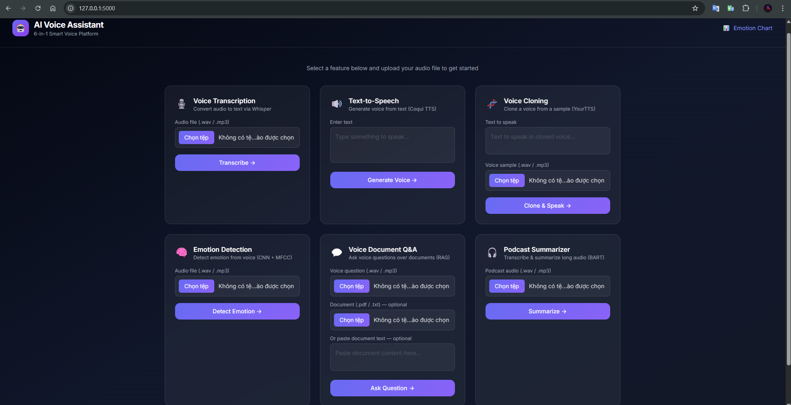

# AI-powered Voice Assistant Suite (6-in-1 Web App)

An AI Voice Assistant web platform combining **6 smart voice modules** — transcription, text-to-speech, voice cloning, emotion detection, document Q&A, and podcast summarization — all accessible via a modern **Flask web interface**.



---

## Table of Contents

1. [Project Overview](#project-overview)
2. [Features](#features)
3. [Project Structure](#project-structure)
4. [Tech Stack](#tech-stack)
5. [Installation & Setup](#installation--setup)
6. [Running the App](#running-the-app)
7. [Feature Details](#feature-details)
8. [How It Works](#how-it-works-behind-the-scenes)
9. [Known Issues & Fixes](#known-issues--fixes)
10. [Future Work](#future-work)
11. [License](#license)
12. [Contributing](#contributing)
13. [Contact](#contact)

---

## Project Overview

This voice assistant toolkit empowers users with:

- 🎙️ Transcription from audio to text (Whisper)
- 🔊 Text-to-Speech voice generation (Coqui TTS / pyttsx3 fallback)
- 🧬 Voice cloning from a reference sample (YourTTS)
- 🧠 Emotion detection from voice (CNN + MFCC, trained on RAVDESS)
- 💬 Voice-based Q&A over documents (Whisper + ChromaDB + SentenceTransformer)
- 🎧 Podcast summarization (Whisper + DistilBART)

Accessible through a **dark-themed, responsive Flask UI** built with Tailwind CSS.

---

## Features

| Feature                 | Description                        | Model / Technique                              |
| ----------------------- | ---------------------------------- | ---------------------------------------------- |
| **Voice Transcription** | Convert audio file to text         | `openai-whisper` (base)                        |
| **Text-to-Speech**      | Generate voice from text input     | `Coqui TTS` / `pyttsx3` fallback               |
| **Voice Cloning**       | Clone a voice from a 3–5s sample | `YourTTS` multi-speaker model                  |
| **Emotion Detection**   | Predict emotion from voice         | `CNN` + `MFCC` (RAVDESS dataset)               |
| **Document Q&A**        | Ask voice questions over documents | `Whisper` + `ChromaDB` + `SentenceTransformer` |
| **Podcast Summarizer**  | Summarize long audio recordings    | `Whisper` + `DistilBART`                       |

---

## Project Structure

```
├── flask_app.py                  # Flask web app
├── __pycache__/  
├── images/                     
├── ravdess-data/                     # RAVDESS dataset
├── templates/                     # HTML interface
├── static/                        # Output audio files
├── uploads/                       # Uploaded inputs
├── voice_transcriber.py           # Feature 1
├── Text_to_Speech_generator.py    # Feature 2
├── voice_cloner.py                # Feature 3
├── emotion_detector.py       # Feature 4 (CNN)
├── voice_rag_agent.py            # Feature 5
├── podcast_summarizer.py         # Feature 6
├── train_emotion_cnn.py          # CNN training script
├── train_emotion_model.py          # RandomForest training script
├── emotion_cnn.pth               # Trained CNN weights
├── emotion_label_encoder.pkl     # Label encoder for emotion
├── requirements-ai.txt                     # Python dependencies
└── README.md
└── LICENSE

```

---

## Tech Stack

| Purpose               | Libraries                                             |
| --------------------- | ----------------------------------------------------- |
| **Transcription**     | `openai-whisper`, `ffmpeg`                            |
| **Text-to-Speech**    | `TTS` (Coqui), `pyttsx3` (fallback)                   |
| **Voice Cloning**     | `TTS` (YourTTS), `sentence-transformers`              |
| **Emotion Detection** | `torch`, `librosa`, `scikit-learn`, `joblib`, `numpy` |
| **Document Q&A**      | `chromadb`, `sentence-transformers`, `transformers`   |
| **Summarization**     | `transformers` (`sshleifer/distilbart-cnn-12-6`)      |
| **Web UI**            | `Flask`, `Jinja2`, `Tailwind CSS`                     |

---

## Installation & Setup

### Prerequisites

- **Python 3.10** (recommended — tested with 3.10.19)
- **Conda** (Anaconda or Miniconda)
- **ffmpeg** (required by Whisper)

### 1. Clone the repository

```bash
git clone https://github.com/VuTuanAnh0949/AI-voice-assistant.git
cd AI-voice-assistant
```

### 2. Create a Conda environment

```bash
conda create -n AI-voice-assistant python=3.10 -y
conda activate AI-voice-assistant
```

### 3. Install Python dependencies

```bash
# Core packages via pip
pip install openai-whisper SpeechRecognition pydub
pip install sentence-transformers transformers
pip install librosa scikit-learn numpy torch matplotlib
pip install nltk joblib flask pyttsx3 pypdf

# chromadb must be installed via conda-forge to avoid C++ build errors
conda install -c conda-forge chromadb -y
```

> **Note:** `TTS` (Coqui) requires **Microsoft C++ Build Tools** on Windows.
>
> - If you have them installed: `pip install TTS`
> - If not: the app will automatically fall back to `pyttsx3` for TTS and Voice Cloning features.

### 4. Install ffmpeg

**Option A – via conda (recommended):**

```bash
conda install -c conda-forge ffmpeg -y
```

**Option B – manual:**
Download from https://ffmpeg.org/download.html and add to system PATH.

### 5. Fix `train_emotion_cnn.py` (important!)

The training script must **not** run on import. Ensure all training code is inside `if __name__ == "__main__":` and the `EmotionCNN` class is defined at module level. The pre-trained weights (`emotion_cnn.pth`) are already included — no need to retrain.

---

## Running the App

```bash
# Activate the environment (always required)
conda activate AI-voice-assistant

# Run the Flask server
python flask_app.py
```

Then open your browser at: **http://127.0.0.1:5000**

> **Windows note:** If `python` uses the wrong interpreter, run explicitly:
>
> ```powershell
> & "C:\Users\<YourUser>\.conda\envs\AI-voice-assistant\python.exe" flask_app.py
> ```

---

## Feature Details

### 1. Voice Transcription

- Upload a `.wav` or `.mp3` audio file.
- Uses **Whisper base** model for multilingual transcription.

### 2. Text-to-Speech

- Type any text → generates a `.wav` voice output.
- Uses **Coqui TTS** (`tacotron2-DDC`) if installed, otherwise **pyttsx3**.
- Output saved to `static/tts_output.wav`.

### 3. Voice Cloning

- Upload a 3–5 second voice sample (`.wav`).
- Type any text → synthesizes speech in the reference speaker's voice.
- Uses **YourTTS** multi-speaker model (requires Coqui TTS).

### 4. Emotion Detection

- Upload a `.wav` audio file.
- Extracts **MFCC** features → feeds into a custom **2-layer CNN**.
- Trained on the **RAVDESS** dataset, predicts one of 8 emotions:
  `neutral`, `calm`, `happy`, `sad`, `angry`, `fearful`, `disgust`, `surprised`
- To retrain: `python train_emotion_cnn.py`

### 5. Voice Document Q&A

- Upload a voice question (`.wav`/`.mp3`) + optionally a document (`.pdf`/`.txt`) or paste text.
- Pipeline: **Whisper** transcribes → **SentenceTransformer** embeds → **ChromaDB** retrieves → LLM answers.

### 6. Podcast Summarizer

- Upload a long audio file (`.wav`/`.mp3`).
- **Whisper** transcribes → text chunked → **DistilBART** summarizes each chunk.

---

## How It Works (Behind the Scenes)

### 1. Voice Transcription

- Whisper converts audio waveform → log-Mel spectrogram → text via multilingual decoder.

### 2. Text-to-Speech

- Tacotron2 converts text → mel-spectrogram → HiFi-GAN vocoder → audio waveform.

### 3. Voice Cloning

- Extract speaker embedding from reference audio → multi-speaker TTS synthesizes matching voice.

### 4. Emotion Detection

- `librosa.load()` → MFCC (40 coefficients, 174 frames) → CNN (2 conv layers) → softmax → emotion label.

### 5. Document Q&A (RAG)

- Whisper transcribes query → SentenceTransformer encodes → ChromaDB vector search → LLM generates answer from retrieved context.

### 6. Podcast Summarization

- Whisper transcribes full audio → NLTK sentence tokenizer → chunks of ~200 words → DistilBART summarizes each → joined output.

---

## Known Issues & Fixes

| Issue                                | Cause                                    | Fix                                                                                                                           |
| ------------------------------------ | ---------------------------------------- | ----------------------------------------------------------------------------------------------------------------------------- |
| `ModuleNotFoundError: whisper`       | Wrong conda env active                   | Run `conda activate AI-voice-assistant`                                                                                       |
| `TTS` install fails on Windows       | Missing Microsoft C++ Build Tools        | Use `pyttsx3` fallback (already in code) or install [Build Tools](https://visualstudio.microsoft.com/visual-cpp-build-tools/) |
| `ffmpeg not found`                   | Whisper requires ffmpeg                  | `conda install -c conda-forge ffmpeg`                                                                                         |
| `chromadb` install fails             | Needs C++ compiler                       | `conda install -c conda-forge chromadb`                                                                                       |
| `RuntimeError: Failed to load audio` | Uploaded a PDF to an audio field         | Upload `.wav` or `.mp3` audio files only                                                                                      |
| `punkt` not found                    | NLTK missing tokenizer                   | `python -c "import nltk; nltk.download('punkt')"`                                                                             |
| CNN model weights error              | Old `torch.load()` call                  | Add `weights_only=True, map_location="cpu"`                                                                                   |
| Training code runs on import         | `train_emotion_cnn.py` module-level code | Move all training code inside `if __name__ == "__main__":`                                                                    |

---

## Future Work

- Real-time streaming voice interface via WebSocket
- REST API for mobile app integration
- Multi-lingual support (Vietnamese, etc.)
- User authentication & session history
- GPU acceleration support
- Export summarization as PDF

---

## License

This project is licensed under the MIT License. See [LICENSE](./LICENSE) for details.

---

## Contributing

Contributions are welcome! Feel free to fork, open issues, or submit pull requests.

---

## Contact

**Vũ Tuấn Anh**

- Email: vutuananh0949@gmail.com
- GitHub: [VuTuanAnh0949](https://github.com/VuTuanAnh0949)
